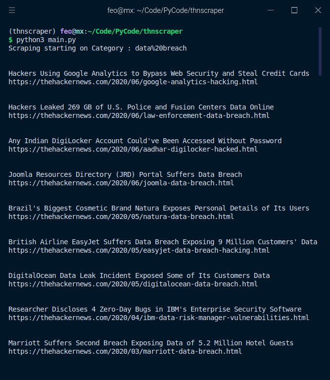

# THN_scraper

> A simple python script that goes to all four category pages in thehackernews.com and grabs all the latest articles and will print the article's title and links to the terminal

---

## Usage

> Clone the repo

`$ git clone https://github.com/VishnuDileesh/THN_scraper`

> Change to the cloned repo

`$ cd THN_scraper`

>  Install the necessary packages

`$ pip3 install -r requirements.txt`

> Running the project

`$ python3 main.py`

